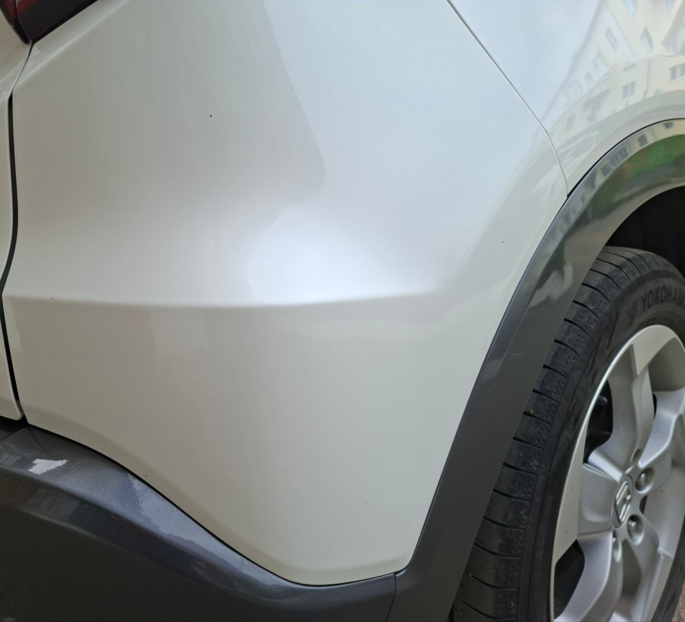
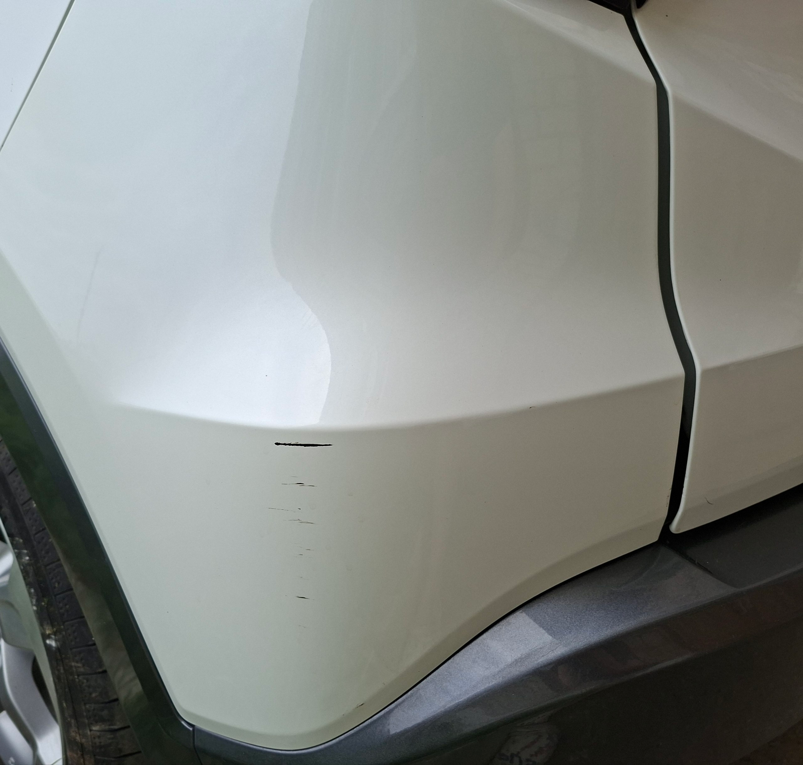

# Single-Sample PCA Image Anomaly Detector with C++ 

C++17 anomaly detection for visual surface inspectation

The algorithm learns normal spatial and color patterns from a **single pristine reference image** using **Principal Component Analysis (PCA)**. When given a candidate test image, it projects each patch into the learned low-dimensional subspace, reconstructs it, and generates a **defect heatmap** based on reconstruction error ($|x - \hat{x}|$).


## 🖼️ Detection Results

### Pristine Reference 

 

### Candidate with Scratch



### Generated Anomaly Heatmap 


## The core math logic

1. **Feature extraction:** Converts images into non-overlapping $8 \times 8 \times 3$ patches (flattened $192$-dimensional vectors).

2. **Subspace training:**
   * Computes dataset mean $\boldsymbol{\mu}$ and centers the patch matrix.
   * Constructs the $192 \times 192$ covariance matrix.
   * Extracts top-$k$ eigenvectors ($\mathbf{W}_k$) using **Power Iteration with Matrix Deflation**.

3. **Inference & Reconstruction:**
   * Projects candidate patches into latent space: $\mathbf{z} = (\mathbf{x} - \boldsymbol{\mu})\mathbf{W}_k^T$
   * Reconstructs clean versions: $\hat{\mathbf{x}} = \mathbf{z}\mathbf{W}_k + \boldsymbol{\mu}$

4. **Defect Detection:** Calculates L1 pixel-wise reconstruction errors ($|\mathbf{x} - \hat{\mathbf{x}}|$) to highlight scratches, dents, or surface anomalies in bright red.

```bash

# compile
g++ -O3 -march=native -fopenmp -std=c++17 main.cpp -o pca_detector

# execute anomaly detection
./pca_detector pristine_surface.jpg candidate_part.jpg defect_heatmap.jpg 8 10.0

```